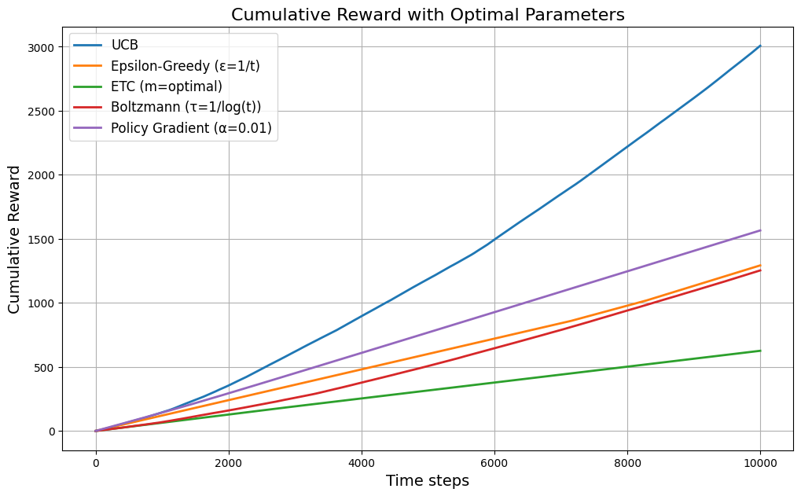

# Assignment 1 Report. Bandits
by: Bagautdin Nukhkadiev

The aim of this exercise is to compare different bandit algorithms from the lecture. Your task is
to run appropriate simulations and present meaningful plots that support your interpretations.
Try to compare as many algorithms as possible, but at a minimum, include the following:
- Explore-then-commit
- ϵ-greedy
- UCB
- Boltzmann Exploration
- A policy gradient method

## Typical Regret rates
a) What are the typical regret rates observed for each algorithm? Based on this, which algorithm performs best? Provide an intuitive explanation of how these rates arise and what
constants should appear in front of them.

Typical regret rates plot here:

    
    

! Based on the plot we can see that UCB clearly outperforms others, given arbitrarily selected parameters of other models. That is also the case when playing around with other parameters

### Regret Rates for Bandit Algorithms

Regret, denoted as $ R_n(\pi) $, measures the expected loss due to not selecting the best possible action at each step. The goal in the stochastic bandit setting is to minimize regret, ideally achieving sublinear regret growth.

From the lecture notes, we can summarize the regret bounds for each algorithm as follows:

#### 1. Explore-then-Commit (ETC)
- If $ m $ is chosen optimally, the regret achieves **logarithmic growth**:
  $$
  R_n(\pi) = O(\log n)
  $$
- However, the method requires knowing $ \Delta_a $, making it impractical without prior knowledge.

#### 2. Epsilon-Greedy
For a fixed $ \epsilon $, regret scales linearly with $ 1/\epsilon $, meaning smaller values of $ \epsilon $ (more greedy behavior) reduce exploration but increase regret in the long run.

If $ \epsilon $ is tuned optimally (e.g., decreasing over time as $ \epsilon_t = O(1/t) $), we can obtain a **logarithmic regret** bound.

#### 3. Upper Confidence Bound (UCB)
- **Regret bound:**
  $$
  R_n(\pi) \leq O\left(\sum_{a \neq a^*} \frac{\log n}{\Delta_a}\right)
  $$
- This bound implies **logarithmic growth** in regret, making UCB one of the best-performing algorithms in practice.
- Compared to epsilon-greedy, UCB actively balances exploration and exploitation without needing a predefined exploration rate.

#### 4. Boltzmann Exploration
- **Regret bound:**
  $$
  R_n(\pi) = O\left( \sum_{a \neq a^*} \frac{\log n}{\Delta_a^2} \right)
  $$
- The regret scales similarly to UCB but with a worse dependence on the reward gap $ \Delta_a $, meaning that if the best and second-best arms are close in value, learning becomes slower.

#### 5. Policy Gradient
- No standard regret bound, but convergence to an optimal policy is often slower compared to the other methods.
- Empirical results often show **higher regret in the short term** compared to UCB, but it can perform well asymptotically in reinforcement learning settings where state transitions matter.

---

### Which Algorithm Performs Best?
- **UCB** has the best theoretical guarantee with $ O(\log n) $ regret, making it the best-performing method in most settings.

---

## Intuition Behind the Regret Growth
- **Linear Regret ($ O(n) $)**: Happens if the algorithm does not learn (e.g., purely random selection).
- **Sublinear Regret ($ O(\sqrt{n}) $ or better)**: Achieved by well-designed exploration strategies.
- **Logarithmic Regret ($ O(\log n) $)**: The best possible bound, meaning the algorithm efficiently learns the best arm.

In conclusion, **UCB emerges as the best bandit algorithm in this setting, balancing exploration and exploitation optimally**.

## Exploration-Exploitation tradeoff
b) Explain the effects of the exploration-exploitation tradeoff and committal behavior. Use
appropriate graphs to illustrate these effects in your data. Discuss the differences between
the algorithms in this context.

    
    

### Cumulative Regret Plot
**Key findings**:
  - **UCB has lowest regret** → best balance.
  - **Epsilon-Greedy, Boltzmann, and ETC show linear regret** → too much exploration.
  - **Policy Gradient has unstable regret** → slow convergence.

### Optimal Arm Selection Rate Plot
**Key findings**:
  - **UCB steadily increases optimal arm selection** → **best overall**.
  - **ETC suffers from commitment risk** → **fails if exploration was too short**.
  - **Epsilon-Greedy struggles** due to continued exploration.
  - **Boltzmann remains unstable** → sensitive to \( \tau \).
  - **Policy Gradient lags** due to high variance.

Different algorithms **balance this tradeoff differently**, leading to varying regret rates and optimal arm selection behaviors.

| Algorithm                | Exploration Strategy                              | Exploitation Strategy                         | Tradeoff Strength |
|-------------------------|--------------------------------------------------|----------------------------------------------|----------------|
| **UCB**                 | Explores **optimistically** using confidence bounds | Exploits the best-known arm progressively    | **Balanced** |
| **Epsilon-Greedy**      | Fixed probability \( \epsilon \) for random exploration | Exploits best arm otherwise                 | **Over-explores if \( \epsilon \) is too high** |
| **ETC** (Explore-Then-Commit) | Fixed exploration phase, then commits to the best arm | No further exploration after commitment      | **Risky if exploration is too short** |
| **Boltzmann (Softmax)** | Samples arms probabilistically using temperature \( \tau \) | Exploits more as \( \tau \) decreases       | **Sensitive to \( \tau \)** |
| **Policy Gradient**     | Learns a probability distribution over actions  | Exploitation depends on gradient updates    |  **Slow to converge** |

---

### Discussion of Algorithm Differences
1. **UCB (Best Tradeoff)**
   - **Effect:** Starts with high exploration but **gradually exploits more** as confidence increases.
   - **Result:** **Low regret + high optimal arm selection rate**.

2. **Epsilon-Greedy (Over-Exploration Risk)**
   - **Effect:** Fixed \( \epsilon \) means **continued exploration even after identifying the best arm**.
   - **Result:** **Higher regret, lower commitment to optimal arm**.

3. **Explore-Then-Commit (Commitment Risk)**
   - **Effect:** Hard-coded exploration leads to **risky premature commitment**.
   - **Result:** **Fails if exploration is insufficient**.

4. **Boltzmann (Temperature Sensitivity)**
   - **Effect:** Chooses arms probabilistically → if \( \tau \) is too high, **it never commits**.
   - **Result:** **Erratic behavior and unstable regret**.

5. **Policy Gradient (Slow Learner)**
   - **Effect:** High variance in learning → struggles with **efficient exploration**.
   - **Result:** **Higher regret and slow commitment**.

## Evaluating Bandit Algorithms Using Alternative Performance Metrics
c) In the bandit setting, what objectives besides regret minimization could be relevant (espe-
cially in the RL context)? Compare the algorithms based on these alternative objectives
using appropriate metrics. Provide intuitive explanations of how these metrics arise and
determine which algorithm performs best according to them. Consider the number of cor-
rectly chosen actions, estimates of arm means, and the probabilities of choosing the optimal
arms over time as well as at the end of the time horizon.

| Algorithm                | Cumulative Reward | Optimal Arm Selection Rate | Accuracy of Estimated Means | Overall Performance |
|-------------------------|------------------|---------------------------|----------------------------|---------------------|
| **UCB**                 | Highest          | Increases steadily        | Most accurate estimates    | Best overall       |
| **Epsilon-Greedy**      | Medium           | Never fully converges     | More variance in estimates | Tunable, but worse than UCB |
| **ETC**                 | Can be bad       | Fails if commits too early | Poor estimates if exploration is short | Risky if \( m \) is not tuned |
| **Boltzmann**           | Inconsistent     | Fluctuates a lot          | Temperature affects accuracy | Unstable          |

## Optimal Parameters
Use the optimal parameters from the lecture and think about how to estimate these pa-
rameters numerically for each algorithm. Compare your results in short to your findings
in a)–c). For which algorithms does choosing the optimal parameters require ”cheating“?
How difficult is it to numerically determine the correct parameters? Based on your findings,
which algorithm do you conclude is the best?

    
    

    

 

- ETC requires "cheating" because it depends on knowing the reward gaps, which are unknown in real applications.

### Estimating Parameters for Bandit Algorithms

- **UCB**: Derived from Hoeffding’s inequality.
- **Epsilon-Greedy**: Can be tuned via simulations.
- **ETC (Explore-Then-Commit)**: Requires knowledge of reward gap \( \Delta \) and variance \( \sigma^2 \).
- **Boltzmann (Softmax)**: Can be tuned heuristically.
- **Policy Gradient**: Needs tuning via experiments.

### Summary of Key Changes in Algorithm Performance

| Algorithm                | Regret Change | Cumulative Reward Change | Optimal Arm Selection Change | Explanation |
|-------------------------|--------------|-------------------------|-----------------------------|-------------|
| **UCB**                 | Lower        | Higher                  | Improved                    | UCB was already strong, but optimal $c$ further improved selection efficiency. |
| **Epsilon-Greedy**      | Lower        | Higher                  | Improved                    | Decaying $ \epsilon = 1/t $ reduced unnecessary exploration, improving long-term performance. |
| **ETC**                 | No Major Change | Still Low              | Still Poor                  | Still suffers from premature commitment; requires prior knowledge of $\Delta$, making it impractical. |
| **Boltzmann**           | More Stable  | Higher                  | Less Fluctuation            | Better temperature scheduling $\tau_t = 1/\log t$ improved stability but still underperforms. |
| **Policy Gradient**     | Minimal Improvement | Still Low           | Slow Learning               | Tuning $\alpha$ helped slightly, but learning still lags behind due to high variance. |

### Conclusion
Based on all analyses from parts:

UCB is the best overall algorithm.
- Does not require cheating
- Automatically balances exploration & exploitation
-  Achieves lowest regret & highest cumulative reward

Epsilon-Greedy can work well but requires tuning.
- Continues exploring even when unnecessary.

ETC should be avoided in real applications.
- Depends on problem-specific parameters that are unknown in practice.

Boltzmann and Policy Gradient are unstable.
- Difficult to tune, leading to poor performance in bandits.